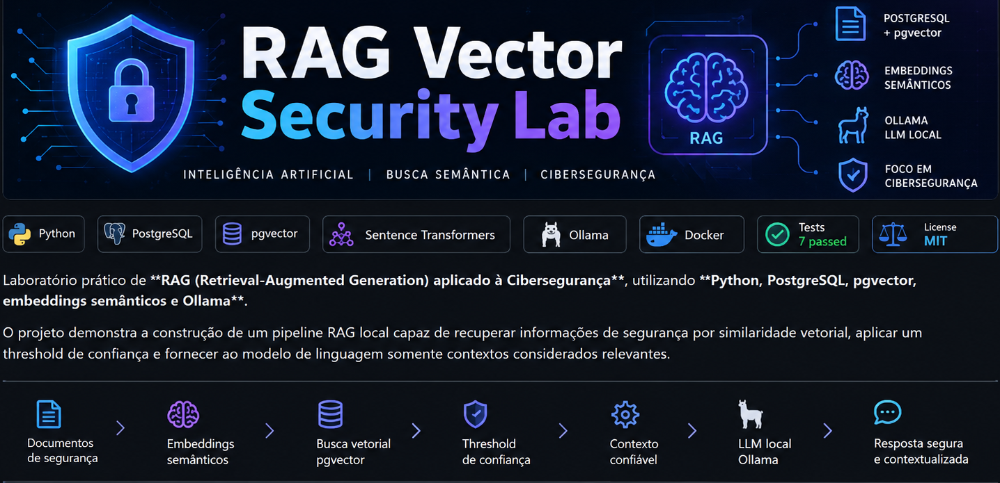

<p align="center">
  
</p>


## 🎯 Objetivo

Construir uma arquitetura RAG voltada para cenários de Segurança Cibernética, combinando:

- armazenamento vetorial;
- embeddings semânticos;
- busca por similaridade;
- filtragem por threshold;
- recuperação de contexto;
- geração de respostas com LLM local;
- fallback seguro quando não existe contexto confiável;
- proteção de credenciais por variáveis de ambiente;
- testes automatizados.

---

## 🧠 Arquitetura

```text
Pergunta do usuário
        │
        ▼
┌───────────────────────┐
│ Geração do Embedding  │
│ Sentence Transformers │
└───────────┬───────────┘
            │
            ▼
┌───────────────────────┐
│ PostgreSQL + pgvector │
│ Busca Vetorial        │
└───────────┬───────────┘
            │
            ▼
┌───────────────────────┐
│ Threshold >= 0.60     │
└───────────┬───────────┘
            │
       ┌────┴────┐
       │         │
       ▼         ▼
   APROVADO   DESCARTADO
       │         │
       ▼         ▼
   Contexto    Sem contexto
   confiável   confiável
       │         │
       ▼         ▼
    Ollama    Resposta segura
       │
       ▼
Resposta baseada
no contexto
```

---

## 🔄 Pipeline RAG

Quando existe contexto confiável:

```text
Pergunta
   ↓
Embedding
   ↓
PostgreSQL + pgvector
   ↓
Busca por similaridade
   ↓
Threshold
   ↓
Contexto confiável
   ↓
Prompt aumentado
   ↓
Ollama
   ↓
Resposta
```

Quando nenhum documento ultrapassa o threshold:

```text
Pergunta
   ↓
Embedding
   ↓
PostgreSQL + pgvector
   ↓
Threshold
   ↓
Sem contexto confiável
   ↓
"Nao ha informacao suficiente no contexto."
```

Nesse cenário, o pipeline termina sem chamar o Ollama.

---

## 🛠️ Tecnologias

| Tecnologia | Utilização |
|---|---|
| Python | Pipeline RAG e processamento |
| PostgreSQL | Persistência dos documentos |
| pgvector | Armazenamento e busca vetorial |
| Sentence Transformers | Geração de embeddings |
| Ollama | Execução local do modelo de linguagem |
| Docker | Infraestrutura PostgreSQL + pgvector |
| Pytest | Testes automatizados |
| Git / GitHub | Versionamento |

---

## 📂 Estrutura do projeto

```text
rag-vector-security-lab/
│
├── src/
│   ├── busca_pgvector.py
│   ├── busca_semantica.py
│   ├── config.py
│   ├── ingestao_pgvector.py
│   ├── primeiro_embedding.py
│   └── rag.py
│
├── tests/
│   └── test_threshold.py
│
├── .env.example
├── .gitignore
├── docker-compose.yml
└── README.md
```

---

## 🔎 Busca vetorial

As perguntas são transformadas em embeddings e comparadas aos vetores armazenados no PostgreSQL utilizando o **pgvector**.

Exemplo validado no laboratório:

```text
Pergunta:
Houve alguma tentativa de phishing?

Resultado:

ID 3 | similaridade 0.8217 | ACEITO
Foi detectada uma tentativa de phishing contra funcionarios.
```

Resultados abaixo do threshold são descartados:

```text
ID 1 | similaridade 0.5786 | DESCARTADO
ID 4 | similaridade 0.4312 | DESCARTADO
```

---

## 🛡️ Threshold de confiança

O projeto utiliza um limite mínimo de similaridade:

```python
SIMILARIDADE_MINIMA = 0.60
```

A decisão de confiança é centralizada na função:

```python
contexto_confiavel(similaridade)
```

Isso permite que somente documentos que atingem o limite configurado sejam enviados como contexto para o modelo de linguagem.

---

## 🚫 Proteção contra contexto insuficiente

O pipeline foi projetado para não utilizar o LLM quando a recuperação vetorial não encontra contexto suficientemente relevante.

Exemplo validado:

```text
Pergunta:
Existe algum incidente envolvendo Kubernetes?

Melhor similaridade:
0.2987

Resultado:
Nao ha informacao suficiente no contexto.

PIPELINE CONCLUIDO SEM CHAMAR O OLLAMA
```

Isso reduz o risco de gerar respostas baseadas em documentos semanticamente distantes da pergunta.

---

## 💡 Exemplos de execução

### Phishing

```powershell
python src\rag.py "Houve alguma tentativa de phishing?"
```

Resultado validado:

```text
Sim, houve uma tentativa de phishing.
```

Similaridade recuperada:

```text
0.8217
```

### Firewall

```powershell
python src\rag.py "O firewall bloqueou alguma tentativa de acesso?"
```

Resultado validado:

```text
Sim, o firewall bloqueou uma tentativa de acesso externo.
```

Similaridade recuperada:

```text
0.8897
```

### Pergunta sem contexto

```powershell
python src\rag.py "Existe algum incidente envolvendo Kubernetes?"
```

Resultado:

```text
Nao ha informacao suficiente no contexto.
```

Nesse cenário, o Ollama não é chamado.

---

## 🔐 Segurança

O projeto utiliza variáveis de ambiente para evitar o versionamento de credenciais reais.

O arquivo:

```text
.env.example
```

serve como modelo de configuração.

O arquivo local:

```text
.env
```

não deve ser enviado ao repositório.

O projeto foi auditado antes da publicação para impedir o versionamento de:

- senhas reais;
- tokens;
- API Keys;
- chaves privadas;
- certificados privados;
- arquivos `.env` reais.

---

## 🐳 PostgreSQL + pgvector

A infraestrutura do banco vetorial pode ser iniciada com Docker Compose:

```powershell
docker compose up -d
```

Para verificar os containers:

```powershell
docker compose ps
```

---

## 🧪 Testes automatizados

O projeto possui testes automatizados para validar o comportamento do threshold.

Execute:

```powershell
python -m pytest -q
```

Estado validado durante o desenvolvimento:

```text
7 passed
```

---

## 🧩 Conceitos explorados

Este laboratório trabalha conceitos de:

- Retrieval-Augmented Generation (RAG);
- Vector Databases;
- Semantic Search;
- Embeddings;
- Similaridade vetorial;
- Context Retrieval;
- LLM local;
- Threshold de confiança;
- PostgreSQL;
- pgvector;
- Ollama;
- Segurança de credenciais;
- Testes automatizados;
- IA aplicada à Cibersegurança.

---

## 🚀 Possíveis evoluções

O laboratório pode evoluir futuramente com:

- ingestão de eventos reais de SOC;
- Threat Intelligence;
- ingestão e correlação de IOCs;
- CVEs e vulnerabilidades;
- integração com MISP;
- integração com APIs de segurança;
- filtros por metadados;
- observabilidade do pipeline RAG;
- avaliação automática da recuperação;
- API com FastAPI;
- interface web;
- integração com agentes de IA;
- automações de segurança.

---

## 👩‍💻 Autora

**Paula Sabino**

Cybersecurity • Inteligência Artificial • Automação • RAG

GitHub: **Paula-Tech007**

---

## 📌 Status do laboratório

| Componente | Status |
|---|---|
| Pipeline RAG | ✅ |
| PostgreSQL | ✅ |
| pgvector | ✅ |
| Embeddings | ✅ |
| Busca semântica | ✅ |
| Threshold | ✅ |
| Ollama | ✅ |
| Fallback sem contexto | ✅ |
| Proteção de credenciais | ✅ |
| Testes automatizados | ✅ |

**Projeto funcional, testado e validado em ambiente local.**
